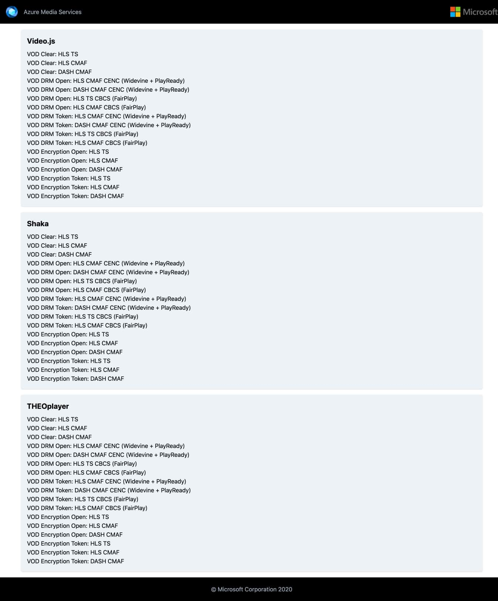

# Media Services 3rd Party Player Samples

## Overview

This repository contains samples, documentation, and platform/browser feature tables for using popular 3rd party player frameworks that support HLS and/or MPEG-DASH delivery from Azure Media Services (AMS).

These are the main components of this repository:

1. [Set up](#set-up)

2. [Samples](#samples)

3. [Test results](#test-results)

## Set up

This project uses PowerShell [setup](/setup) scripts to generate content (VOD and Live) in Azure Media Services and provides tools to test the 3rd party players in different combinations of features, streaming formats, and content protection.

For example, this is the *_Index_* page generated after running the setup scripts. It contains the playback endpoints for all the features, formats, and content protection options available in Azure Media Services along with links to test them on each 3rd party player sample:

## Samples

The repository contains a sample implementation of each player. The sample is a minimal player implementation using captioning and content protection (DRM and Encryption).

To see the sample code, please check:

- [Video.js](/src/video.js)
- [Shaka Player](/src/shaka)
- [hls.js](/src/hls.js)
- [dash.js](/src/dash.js)
- [ExoPlayer](/src/exoplayer)
- [AVPlayer](/src/avplayer)
- [THEOplayer](/src/THEOplayer)
- [NexPlayer](/src/NexPlayer)
## Test results
  
The samples were tested with VOD and Live content generated with the setup script in the following browsers:

- Windows 10 v1909+
  -  Chrome (v83.0.4103.97+)
  -  Firefox (v77.0.1+)
  -  Edge Chromium-based (v83.0.478.50+)
  -  Edge (v44.18362.449.0+)
- macOS v10.15.5+
  -  Chrome (v83.0.4103.97+)
  -  Safari (v13.1.1+)
- Ubuntu v18.04.3 LTS+
  -  Chrome (v79.0.3945.130+)
  -  Firefox (v76.0.1+)
- Android v8+
  -  Chrome (v83.0.4103.97+)
  -  Firefox (v68.9+)
- iOS v13.5.1+
  -  Chrome (v83.0.4103.88+)
  -  Safari (v13.1+)

To see the test results, please check:
  
- [Video.js](/docs/video.js#test-results)
- [Shaka Player](/docs/shaka#test-results)
- [hls.js](/docs/hls.js#test-results)
- [dash.js](/docs/dash.js#test-results)
- [ExoPlayer](/docs/exoplayer#test-results)
- [AVPlayer](/docs/avplayer#test-results)
- [THEOplayer](/docs/THEOplayer#test-results)
- [NexPlayer](/docs/NexPlayer#test-results)

## How to set up your player

To set up your player, follow the below instructions:

- [How to use the Video.js player with Azure Media Services](https://docs.microsoft.com/azure/media-services/latest/how-to-video-js-player)
- [How to use the Shaka player with Azure Media Services](https://docs.microsoft.com/azure/media-services/latest/how-to-shaka-player)
- [How to use the hls.js player with Azure Media Services](/docs/hls.js/how-to-hls-js-player.md)
- [How to use the dash.js player with Azure Media Services](/docs/dash.js/how-to-dash-js-player.md)
- [How to use the ExoPlayer with Azure Media Services](/docs/exoplayer/how-to-exoplayer.md)
- [How to use the AVPlayer with Azure Media Services](/docs/avplayer/how-to-avplayer.md)
- [How to use the THEOplayer with Azure Media Services](/docs/THEOplayer/how-to-theo-player.md)
- [How to use the NexPlayer with Azure Media Services](/docs/NexPlayer/how-to-nex-player.md)

## Root contents

| File/folder         | Description                                |
|---------------------|--------------------------------------------|
| `src`               | Folder with 3rd party player samples                |
| `docs`              | Folder with test results|
| `setup`             | Folder with AMS setup scripts             |
| `.gitignore`        | Define what to ignore at commit time      |
| `CHANGELOG.md`      | List of changes to the sample             |
| `CONTRIBUTING.md`   | Guidelines for contributing to the sample |
| `LICENSE`           | The license for the sample                |
| `README.md`         | This README file                          |

## Contributing

This project welcomes contributions and suggestions.  Most contributions require you to agree to a
Contributor License Agreement (CLA) declaring that you have the right to grant us
the rights to use your contribution. For details, visit <https://cla.opensource.microsoft.com>.

When you submit a pull request, a CLA bot will automatically determine whether you need to provide
a CLA and decorate the PR appropriately (e.g., status check, comment). Simply follow the instructions
provided by the bot. You will only need to do this once across all repos using our CLA.

This project has adopted the [Microsoft Open Source Code of Conduct](https://opensource.microsoft.com/codeofconduct/).
For more information see the [Code of Conduct FAQ](https://opensource.microsoft.com/codeofconduct/faq/) or
contact [opencode@microsoft.com](mailto:opencode@microsoft.com) with any additional questions or comments.
