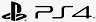

# Media Services 3rd Party Player Samples - NexPlayer

- [Overview](#overview)
- [Implementation reference sample](#implementation-reference-sample)
- [Test results](#test-results)

## Overview

NexPlayer is the market leader player SDK for premium video apps. NexPlayer ensures the best video streaming quality across all devices with the most advanced features and 24/7 customer support. Available for Android, iOS, Fire TV, LG webOS, Samsung Tizen, HTML5, Chromecast, Xbox and PlayStation apps.

Its official documentation can be found [here](https://nexplayersdk.com// "NexPlayer documentation").

For detailed instructions on how to implement the player, see [How to use NexPlayer with Azure Media Service](how-to-nex-player.md)

------------

## Implementation reference sample

For an implementation reference sample please check the following [link](../../src/NexPlayer) which contains an implementation of NexPlayer.

------------

## Test results

References:

- ✔️ All scenarios are supported in all tested browsers with both VOD and Live content (including Live Transcription and Low Latency).

- ⚠️ Some scenarios may not be supported (for more information, click more details at the bottom).

- ❌ No scenario is supported.

### Windows 10 v1909+

Tested on:

-  Chrome (v83.0.4103.97+)
-  Firefox (v77.0.1+)
-  Edge Chromium-based (v83.0.478.50+)
-  Edge (v44.18362.449.0+)

##### VOD and Live content

| Format | Clear | Widevine | PlayReady | FairPlay | AES-128 | Captions |
| --------- | :---: | :----------------------------------------------------------: | :------: | :----------------------------------------------------------: | :------: | :------: |
| HLS TS    | ✔️ | ⚠️ | Not applicable | Not applicable | ✔️ | ✔️ |
| HLS CMAF  | ✔️ | ✔️ | Not  applicable | Not applicable | ⚠️ | ✔️ |
| DASH CMAF | ✔️ | ✔️ |  | Not applicable | Not applicable | ✔️ |

##### Low Latency Live Streaming

| Format | Clear | Widevine | PlayReady | FairPlay | AES-128 |
| --------- | :---: | :----------------------------------------------------------: | :------: | :----------------------------------------------------------: | :------: |
| HLS TS    | ✔️ | ⚠️ | Not applicable | Not applicable | ⚠️ | 
| HLS CMAF  | ✔️ | ⚠️ | Not applicable | Not applicable | ⚠️ | 
| DASH CMAF | ✔️ | ⚠️ | ⚠️ | Not applicable | Not applicable | 

[More details](./results/windows.md)

### macOS v10.15.6+

Tested on:

-  Chrome (v83.0.4103.97+)
-  Firefox (v77.0.1+)
-  Edge Chromium-based (v83.0.478.50+)
-  Safari (v13.1.1+)

##### VOD and Live content

| Format | Clear | Widevine | PlayReady | FairPlay | AES-128 | Captions |
| --------- | :---: | :----------------------------------------------------------: | :------: | :----------------------------------------------------------: | :------: | :------: |
| HLS TS    | ✔️ | ⚠️ | Not applicable |  | ✔️ | ✔️ |
| HLS CMAF  | ✔️ |    | Not applicable |  | ⚠️ | ✔️ |
| DASH CMAF |    |    | Not applicable | Not applicable | Not applicable | ✔️ |

##### Low Latency Live Streaming

| Format | Clear | Widevine | PlayReady | FairPlay | AES-128 |
| --------- | :---: | :----------------------------------------------------------: | :------: | :----------------------------------------------------------: | :------: |
| HLS TS    | ✔️ | ⚠️ | Not applicable | ⚠️ | ⚠️ | 
| HLS CMAF  | ✔️ | ⚠️ | Not applicable | ⚠️ | ⚠️ | 
| DASH CMAF | ✔️ | ⚠️ | Not applicable | Not applicable | Not applicable | 

[More details](./results/macOS.md)

### Ubuntu v18.04.3 LTS+

Tested on:

-  Chrome (v83.0.4103.97+)
-  Safari (v13.1.1+)

##### VOD and Live content

| Format | Clear | Widevine | PlayReady | FairPlay | AES-128 | Captions |
| --------- | :---: | :----------------------------------------------------------: | :------: | :----------------------------------------------------------: | :------: | :------: |
| HLS TS    | ✔️ | ⚠️ | Not applicable |  | ✔️ | ✔️ |
| HLS CMAF  | ✔️ |  | Not applicable |  | ⚠️ | ✔️ |
| DASH CMAF |  |  | Not applicable | Not applicable | Not applicable | ✔️ |

##### Low Latency Live Streaming

| Format | Clear | Widevine | PlayReady | FairPlay | AES-128 |
| --------- | :---: | :----------------------------------------------------------: | :------: | :----------------------------------------------------------: | :------: |
| HLS TS    | ✔️ | Not tested | Not applicable | Not tested | Not tested | 
| HLS CMAF  | ✔️ | Not tested | Not applicable | Not tested | Not tested | 
| DASH CMAF | ✔️ | Not tested | Not applicable | Not applicable | Not applicable | 

[More details](./results/ubuntu.md)

### Android v8+

Tested on:

-  Chrome (v83.0.4103.97+)
-  Firefox (v68.9+)
-  Edge Chromium-based (v83.0.478.50+)

##### VOD and Live content

| Format | Clear | Widevine | PlayReady | FairPlay | AES-128 | Captions |
| --------- | :---: | :----------------------------------------------------------: | :------: | :----------------------------------------------------------: | :------: | :------: |
| HLS TS    | ✔️ | ⚠️ | Not applicable | Not applicable | ✔️ | ✔️ |
| HLS CMAF  | ✔️ | ✔️ | Not applicable | Not applicable | ⚠️ | ✔️ |
| DASH CMAF | ✔️ | ✔️ | Not applicable | Not applicable | Not applicable | ✔️ |

##### Low Latency Live Streaming

| Format | Clear | Widevine | PlayReady | FairPlay | AES-128 | 
| --------- | :---: | :----------------------------------------------------------: | :------: | :----------------------------------------------------------: | :------: |
| HLS TS    | ✔️ | Not tested | Not applicable | Not applicable | Not tested | 
| HLS CMAF  | ✔️ | Not tested | Not applicable | Not applicable | Not tested | 
| DASH CMAF | ✔️ | Not tested | Not applicable | Not applicable | Not applicable | 

[More details](./results/android.md)

### iOS v13.5.1+

Tested on:

-  Chrome (v83.0.4103.97+)
-  Firefox (v77.0.1+)
-  Edge Chromium-based (v83.0.478.50+)
-  Safari (v13.1.1+)

##### VOD and Live content

| Format | Clear  | Widevine | PlayReady | FairPlay | AES-128 | Captions |
| --------- | :---: | :----------------------------------------------------------: | :------: | :----------------------------------------------------------: | :------: | :------: |
| HLS TS    | ✔️ | ⚠️ | Not applicable |  | ✔️ | ✔️ |
| HLS CMAF  | ✔️ |    | Not applicable |  | ⚠️ | ✔️ |
| DASH CMAF | Not applicable | Not applicable | Not applicable | Not applicable | Not applicable | Not applicable |

##### Low Latency Live Streaming

| Format | Clear | Widevine | PlayReady | FairPlay | AES-128 | 
| --------- | :---: | :----------------------------------------------------------: | :------: | :----------------------------------------------------------: | :------: |
| HLS TS    | ✔️ | Not tested | Not applicable | Not tested | Not tested | 
| HLS CMAF  | ✔️ | Not tested | Not applicable | Not tested | Not tested | 
| DASH CMAF | Not applicable | Not applicable | Not applicable | Not applicable | Not applicable |

[More details](./results/ios.md)

### webOS v3.0+

Tested on:

-  webOS SDK (v3.0+)

##### VOD and Live content

| Format | Clear | Widevine | PlayReady | FairPlay | AES-128 | Captions |
| --------- | :---: | :----------------------------------------------------------: | :------: | :----------------------------------------------------------: | :------: | :------: |
| HLS TS    | ✔️ | ⚠️ | Not applicable | Not applicable | ❌ | ✔️ |
| HLS CMAF  | ✔️ | ✔️ | Not applicable | Not applicable | ⚠️ | ✔️ |
| DASH CMAF | ✔️ | ✔️ | ✔️ | Not applicable | Not applicable | ✔️ |

##### Low Latency Live Streaming

| Format | Clear | Widevine | PlayReady | FairPlay | AES-128 | 
| --------- | :---: | :----------------------------------------------------------: | :------: | :----------------------------------------------------------: | :------: |
| HLS TS    | ⚠️ | ⚠️ | Not applicable | Not applicable | Not tested | 
| HLS CMAF  | ⚠️ | ⚠️ | Not applicable | Not applicable | Not tested | 
| DASH CMAF | ⚠️ | ⚠️ | Not tested | Not applicable | Not applicable |

[More details](./results/webOS.md)

### Tizen v2.4+

Tested on:

-  tizen SDK (v2.4+)

##### VOD and Live content

| Format | Clear | Widevine | PlayReady | FairPlay | AES-128 | Captions |
| --------- | :---: | :----------------------------------------------------------: | :------: | :----------------------------------------------------------: | :------: | :------: |
| HLS TS    | ✔️ | ⚠️ | Not applicable | Not applicable | ❌ | ✔️ |
| HLS CMAF  | ✔️ | ✔️ | Not applicable | Not applicable | ⚠️ | ✔️ |
| DASH CMAF | ✔️ | ✔️ | ✔️ | Not applicable | Not applicable | ✔️ |

##### Low Latency Live Streaming

| Format | Clear | Widevine | PlayReady | FairPlay | AES-128 | 
| --------- | :---: | :----------------------------------------------------------: | :------: | :----------------------------------------------------------: | :------: |
| HLS TS    | ⚠️ | ⚠️ | Not applicable | Not applicable | Not tested | 
| HLS CMAF  | ⚠️ | ⚠️ | Not applicable | Not applicable | Not tested | 
| DASH CMAF | ⚠️ | ⚠️ | Not tested | Not applicable | Not applicable |

[More details](./results/tizen.md)

### Xbox

Tested on:

-  Xbox

##### VOD and Live content

| Format | Clear | Widevine | PlayReady | FairPlay | AES-128 | Captions |
| --------- | :---: | :----------------------------------------------------------: | :------: | :----------------------------------------------------------: | :------: | :------: |
| HLS TS    | ✔️ | Not applicable | Not applicable | Not applicable | ❌ | ✔️ |
| HLS CMAF  | ✔️ | Not applicable | Not applicable | Not applicable | ⚠️ | ✔️ |
| DASH CMAF | ✔️ | Not applicable | ✔️ | Not applicable | Not applicable | ✔️ |

##### Low Latency Live Streaming

| Format | Clear | Widevine | PlayReady | FairPlay | AES-128 | 
| --------- | :---: | :----------------------------------------------------------: | :------: | :----------------------------------------------------------: | :------: |
| HLS TS    | ⚠️ | Not applicable | Not applicable | Not applicable | Not tested | 
| HLS CMAF  | ⚠️ | Not applicable | Not applicable | Not applicable | Not tested | 
| DASH CMAF | ⚠️ | Not applicable | Not tested | Not applicable | Not applicable |

[More details](./results/xbox.md)

### Play Station 5

Tested on:

-  Play Station 5

##### VOD and Live content

| Format | Clear | Widevine | PlayReady | FairPlay | AES-128 | Captions |
| --------- | :---: | :----------------------------------------------------------: | :------: | :----------------------------------------------------------: | :------: | :------: |
| HLS TS    | ✔️ | Not applicable | Not applicable | Not applicable | ❌ | ✔️ |
| HLS CMAF  | ✔️ | Not applicable | Not applicable | Not applicable | ⚠️ | ✔️ |
| DASH CMAF | ✔️ | Not applicable | ✔️ | Not applicable | Not applicable | ✔️ |

##### Low Latency Live Streaming

| Format | Clear | Widevine | PlayReady | FairPlay | AES-128 | 
| --------- | :---: | :----------------------------------------------------------: | :------: | :----------------------------------------------------------: | :------: |
| HLS TS    | ⚠️ | Not applicable | Not applicable | Not applicable | Not tested | 
| HLS CMAF  | ⚠️ | Not applicable | Not applicable | Not applicable | Not tested | 
| DASH CMAF | ⚠️ | Not applicable | Not tested | Not applicable | Not applicable |

[More details](./results/ps5.md)

### Play Station 4

Tested on:

-  Play Station 4

##### VOD and Live content

| Format | Clear | Widevine | PlayReady | FairPlay | AES-128 | Captions |
| --------- | :---: | :----------------------------------------------------------: | :------: | :----------------------------------------------------------: | :------: | :------: |
| HLS TS    | ✔️ | Not applicable | Not applicable | Not applicable | ⚠️ | ✔️ |
| HLS CMAF  | ✔️ | Not applicable | Not  applicable | Not applicable | ⚠️ | ✔️ |
| DASH CMAF | ✔️ | Not applicable | ✔️ | Not applicable | Not applicable | ✔️ |

##### Low Latency Live Streaming

| Format | Clear | Widevine | PlayReady | FairPlay | AES-128 | 
| --------- | :---: | :----------------------------------------------------------: | :------: | :----------------------------------------------------------: | :------: |
| HLS TS    | ⚠️ | Not applicable | Not applicable | Not applicable | Not tested | 
| HLS CMAF  | ⚠️ | Not applicable | Not applicable | Not applicable | Not tested | 
| DASH CMAF | ⚠️ | Not applicable | Not tested | Not applicable | Not applicable |

[More details](./results/ps4.md)
