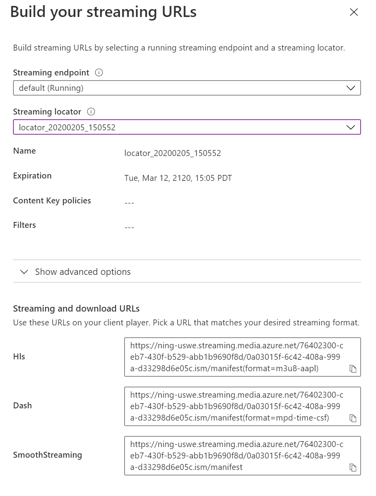

# How to use the dash.js player with Azure Media Service

## Overview

dash.js is an initiative of the DASH Industry Forum to establish a production quality framework for building video and audio players that play back MPEG-DASH content using client-side JavaScript libraries leveraging the Media Source Extensions API set as defined by the W3C.

Its official documentation can be found [here](https://github.com/Dash-Industry-Forum/dash.js/wiki).

## Sample code

Sample code for this article is available at [Azure-Samples/media-services-3rdparty-player-samples](https://github.com/Azure-Samples/media-services-3rdparty-player-samples)

## Implementing the player

1. Create an `index.html` file where you'll host the player. Add the following lines of code (you can replace the versions for newer if applicable):

    ```html
    <html>
      <body>
        <video id="video"></video>
        <script src="//cdnjs.cloudflare.com/ajax/libs/dashjs/3.1.2/dash.all.debug.js"></script>
        <script type="module" src="index.js"></script>
      </body>
    <html>
    ```

2. Add an `index.js` file with the following code:

    ```javascript
    var video = document.getElementById('video');
    var player = dashjs.MediaPlayer().create()
    var url = 'manifestUrl'
    player.initialize(video, url, true)
    ```

3. Replace manifestUrl with the DASH URL from the streaming locator of your asset which can be found on the streaming locator page in the Azure portal.

    

The above code will create a new DASH object that will attach to the video HTML element to play the streaming content. Replace `MANIFESTURL` with the manifest URL of your choice.

### Set up captions

For TTML embedded captions an empty div must be added:

```html
<div id="ttml-rendering-div"></div>
```

And then assign to the player that div and enable the default text:

```javascript
var TTMLRenderingDiv = document.querySelector("#ttml-rendering-div")
player.setTextDefaultEnabled(true)
player.attachTTMLRenderingDiv(TTMLRenderingDiv)
```

And for Sidecar caption you must:

- In HTML add the label `<track>` in `<video>` as the following code:

  ```html
  <video id="video" controls crossorigin="true">
    <track label="Captions" kind="subtitles" src="YOUR URL WITH CAPTIONS" srclang="ls" id="inputvtt" >
  </video>
  ```

### Set up token authentication

For DRM protected content with token you can add to the protection data the authorization header and you must set `withCredentials` as false:

```javascript
player.setProtectionData({
  "com.widevine.alpha": {
    "serverURL": WidevineLicenseUrl,
    "httpRequestHeaders": {
      "authorization": "Bearer=" + JWTToken
    },
    "withCredentials": false
  },
  "com.microsoft.playready": {
    "serverURL": PlayReadyLicenseUrl,
    "httpRequestHeaders": {
      "authorization": "Bearer=" + JWTToken
    },
    "withCredentials": false
  }
})
```

### Set up AES-128 encryption

There is currently no support for AES-128 encryption, as stated in [this GitHub issue](https://github.com/Dash-Industry-Forum/dash.js/issues/1993).

### Set up DRM protection

For setting up DRM (PlayReady or Widevine) you must set the protection data.
For this you can replace the `WidevinLicenseUrl` and `PlayReadyLicenseUrl` with the correct URLs in the following code:

```javascript
player.setProtectionData({
  "com.widevine.alpha": {
    "serverURL": WidevineLicenseUrl
  },
  "com.microsoft.playready": {
    "serverURL": PlayReadyLicenseUrl
  }
})
```

#### Acquiring the license URL

In order to acquire the license URL, you can:

- Consult your DRM provider configuration
- or, consult the `output.json` document generated when you previously ran the [setup-vod.ps1](../../setup#setup-vodps1) for VODs, or [start-live.ps1](../../setup#start-liveps1) for live streams; you'll also find the KIDs inside this file.
