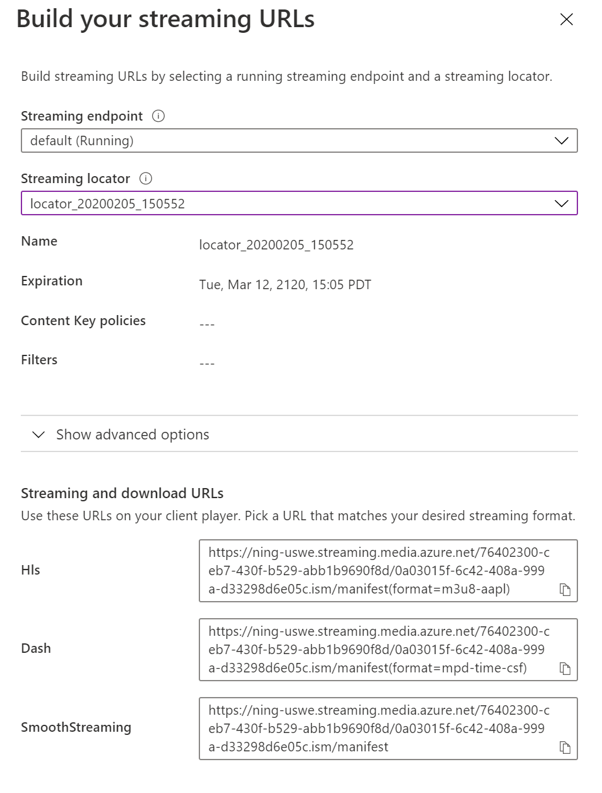

# How to use the hls.js player with Azure Media Service

## Overview

hls.js is a JavaScript library which implements an HTTP Live Streaming client. It relies on HTML5 video and MediaSource Extensions for playback.

It works by transmuxing MPEG-2 Transport Stream and AAC/MP3 streams into ISO BMFF (MP4) fragments. This transmuxing could be performed asynchronously using Web Worker if available in the browser. hls.js also supports HLS + fmp4, as announced during WWDC2016

hls.js does not need any player, it works directly on top of a standard HTML `<video>` element.

Its official documentation can be found [here](https://github.com/video-dev/hls.js/blob/master/docs/API.md).

## Sample code

Sample code for this article is available at [Azure-Samples/media-services-3rdparty-player-samples](https://github.com/Azure-Samples/media-services-3rdparty-player-samples)

## Implementing the player

1. Create an `index.html` file where you'll host the player. Add the following lines of code (you can replace the versions for newer if applicable):

    ```html
    <html>
      <body>
        <video id="video"></video>
        <script src="//cdn.jsdelivr.net/npm/hls.js@0.14.2/dist/hls.min.js"></script>
        <script type="module" src="index.js"></script>
      </body>
    <html>
    ```

2. Add an `index.js` file with the following code:

    ```javascript
    if (Hls.isSupported()) {
      var video = document.getElementById('video');
      var hls = new Hls();

      hls.attachMedia(video);
      hls.on(Hls.Events.MEDIA_ATTACHED, function () {
        hls.loadSource('manifestUrl');
      });
    }
    ```

3. Replace manifestUrl with the HLS or DASH URL from the streaming locator of your asset which can be found on the streaming locator page in the Azure portal.

    

The above code will create a new HLS object that will attach to the video HTML element to play the streaming content. Replace `MANIFESTURL` with the manifest URL of your choice.

### Set up captions

In HTML add the label `<track>` in `<video>` as the following code:

  ```html
  <video id="video" controls crossorigin="true">
    <track label="Captions" kind="subtitles" src="YOUR URL WITH CAPTIONS" srclang="ls" id="inputvtt" >
  </video>
  ```

### Set up token authentication

For token encryption you have to append an Authorization header to the request that is sent to the encryption key endpoint. hls.js API allows us to send a function callback as config parameter to append this header (xhrSetup for encryption token and licenseXhrSetup for DRM token). For encryption token the callback is called for every request made to the streaming endpoint (E.g. requests for playlist, fragments, subtitles, etc), because of this we have to check for the encryption key url sent in the parameter. For DRM token we need to set the callback to licenseXhrSetup. Replace `token` with your token string:

```javascript
// append authorization header for encryption token
Object.assign(config, {
  xhrSetup: (xhr, url) => {
    const encryptionKeyUrl = 'ENCRYPTION KEY URL'
    // check for encryption key url and append only for that xhr
    if (encryptionKeyUrl !== url) {
      return
    }
    xhr.setRequestHeader('Authorization', 'Bearer=' + token)
  }
})

// append authorization header for DRM token
Object.assign(config, {
  licenseXhrSetup: (xhr, url) => {
    xhr.setRequestHeader('Authorization', 'Bearer=' + token)
  }
})
```

### Set up AES-128 encryption

The player hls.js supports AES-128 right out of the box without any additional configuration.

### Set up DRM protection

Configuration parameters could be provided to hls.js upon instantiation of Hls object. The config should be like the following code:

```javascript
const config = {
  widevineLicenseUrl: "YOUR URL WIDEVINE LICENSE",
  emeEnabled: true
}
new Hls(config)
 ```

#### Acquiring the license URL

In order to acquire the license URL, you can:

- Consult your DRM provider configuration
- or, consult the `output.json` document generated when you previously ran the [setup-vod.ps1](../../setup#setup-vodps1) for VODs, or [start-live.ps1](../../setup#start-liveps1) for live streams; you'll also find the KIDs inside this file.
