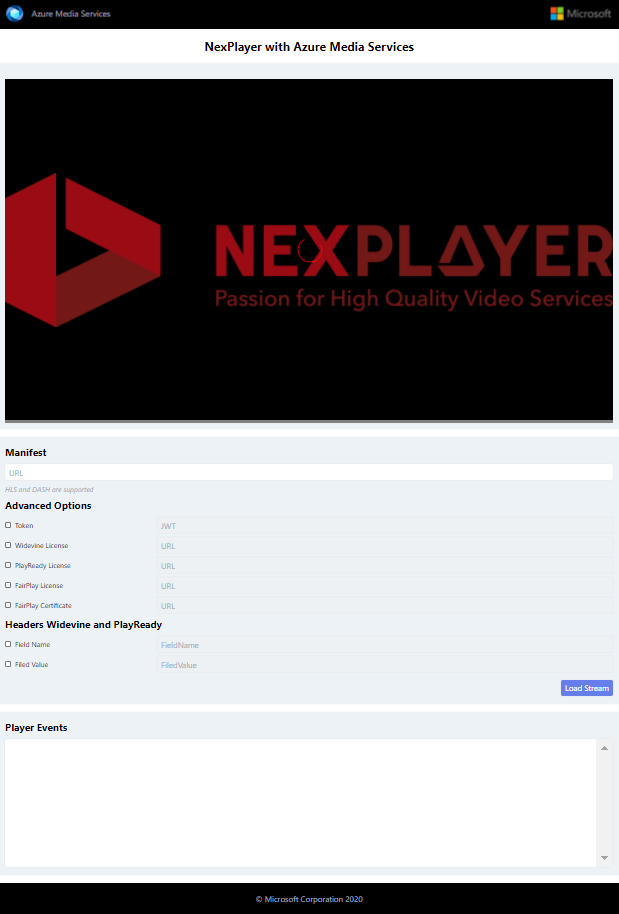

# Media Services 3rd Party Player Samples - NexPlayer

- [Overview](#overview)
- [How to use](#how-to-use)
  - [Setup development environment](#setup-development-environment)
  - [Using sample player](#using-sample-player)
  - [Sample details](#sample-details)

## Overview

The NexPlayer HTML5 Player is a fully customizable media player that enables HLS and MPEG-DASH streaming with broadcast quality video across all platforms, browsers and devices. Premium OTT services can now provide an outstanding user experience thanks to a flexible feature set including the latest playback capabilities, advanced DRM content protection and advertisements like client-side ad insertion (CSAI) with VPAID, VMAP, VAST and server-side ad insertion (SSAI). 

Documentation on how to implement your own player and test results with different formats and browsers [here](../../docs/NexPlayer).

## How to use

### Setup development environment

- Install [NodeJS v8+](https://nodejs.org/en/download/ "NodeJS v8+").

### Using sample player

1. You will require a NexPlayer license if you plan on running NexPlayer in your production environment. You can start your free trial [here](https://nexplayersdk.com/html5-player/). You do not require a license to run on localhost.
2. Clone this repository.
3. Navigate through the console to the example's folder (src/) and run `npx http-server`. (*)
4. Open the browser of your choice and go to `http://localhost:8080/`.
5. Copy the link to your manifest URL and paste it in the `Manifest URL` field and click `Load Stream`. Your video is now loaded.

### Sample details

This player sample contains different options embedded into the player, that you can set once it's loaded.

- Manifest: Endpoint URL to the Azure Media Service content. This URL is different for each case depending on the protocol and encryption method used.
- Closed Captions and Subtitles: Nexplayer supports WebVTT subtitles and closed captions. Available subtitles can be retrieved via the textTracks attribute of the video element.
- Multiple audio: NexPlayer supports multiple audio and language tracks in one single video – both for live and on demand streaming. Using streams with multiple audio features provides multiple language tracks for your video content.
- Playback: NexPlayer offers more advanced options to control the playback. This feature tells the player whether to start playback with the volume muted or not. Once the callback is received, the playback can be controlled within the NexPlayer instance and the associated video element.
- Adaptive bitrate: Enhance viewer experience by optimizing video ABR.
- Widevine License: URL to the Widevine license required to play Widevine content.
- PlayReady License: URL to the PlayReady license required to play PlayReady content.
- FairPlay License: URL to the FairPlay license required to play FairPlay content.
- FairPlay Certificate: URL to the FairPlay Certificate to use for playing FairPlay content.

