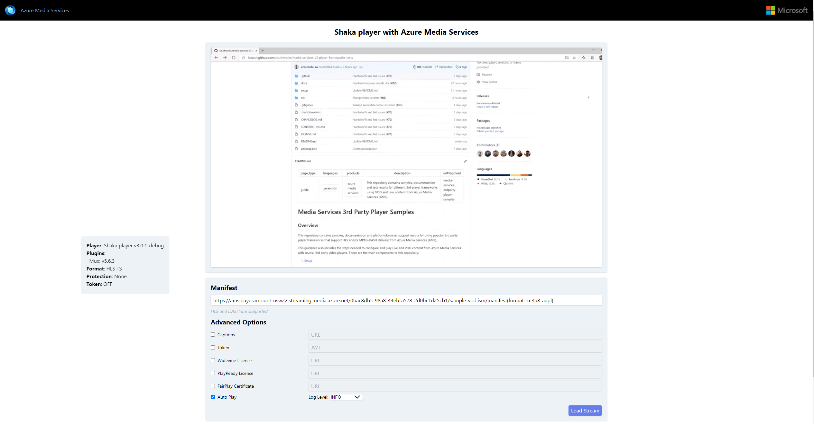

# Media Services 3rd Party Player Samples - Shaka Player

- [Overview](#overview)
- [How to use](#how-to-use)
  - [Set up development environment](#setup-development-environment)
  - [Using sample player](#using-sample-player)
  - [Sample details](#sample-details)

## Overview

Shaka Player is an open-source JavaScript library for adaptive media. It plays adaptive media formats (such as DASH and HLS) in a browser, without using plugins or Flash. Instead, Shaka Player uses the open web standards MediaSource Extensions and Encrypted Media Extensions.

Documentation on how to implement your own player and test results with different formats and browsers [here](../../docs/shaka).

## How to use

### Set up development environment

- Install [NodeJS v8+](https://nodejs.org/en/download/ "NodeJS v8+").

### Using sample player

1. Clone this repository.
2. Navigate through the console to the example's folder (src/) and run `npx http-server`. (*)
3. Open the browser of your choice and go to `http://localhost:8080/`.
4. Copy the link to your manifest URL and paste it in the `Manifest URL` field and click `Load Stream`.

(*) Alternatively, you can run the [script](../../setup#upload-samplesps1) to host your player in a static website using your Azure account.

**Your video is now loaded.**

### Sample details

This player sample contains different options that you can set using query strings or manually set them once it's loaded.

- Manifest: Endpoint URL to the Azure Media Service content which is different for each case depending on the protocol and encryption method used
- Captions: URL for the video .vtt file needed to display captions
- Token: JWT authentication token needed when using an encryption method (DRM or AES-128)
- FairPlay Certificate: URL to the FairPlay Certificate to use for playing FairPlay content

