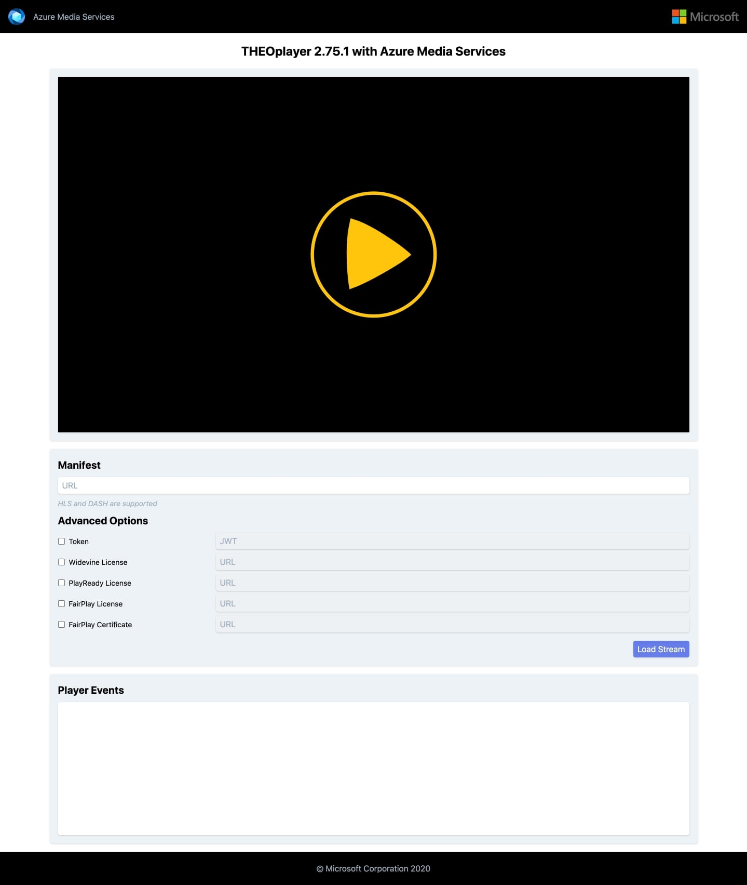

# Media Services 3rd Party Player Samples - THEOplayer

- [Overview](#overview)
- [How to use](#how-to-use)
  - [Setup development environment](#setup-development-environment)
  - [Using sample player](#using-sample-player)
  - [Sample details](#sample-details)

## Overview

THEOplayer is a Universal Video Player solution, that enables online media companies and enterprises worldwide to quickly bring a consistent video playback experience across any device or platform through its feature-rich SDKs and a wide variety of video ecosystem pre-integrations.

Documentation on how to implement your own player and test results with different formats and browsers [here](../../docs/THEOplayer).

## How to use

### Setup development environment

- Install [NodeJS v8+](https://nodejs.org/en/download/ "NodeJS v8+").

### Using sample player

1. You will require a THEOplayer license if you plan on running THEOplayer in your production environment. You can start your free trial [here](https://portal.theoplayer.com/). You do not require a license to run on localhost.
2. Clone this repository.
3. Navigate through the console to the example's folder (src/) and run `npx http-server`. (*)
4. Open the browser of your choice and go to `http://localhost:8080/`.
5. Copy the link to your manifest URL and paste it in the `Manifest URL` field and click `Load Stream`. Your video is now loaded.

### Sample details

This player sample contains different options embedded into the player, that you can set once it's loaded.

- Manifest: Endpoint URL to the Azure Media Service content. This URL is different for each case depending on the protocol and encryption method used.
- Closed Captions and Subtitles: THEOplayer supports WebVTT subtitles and closed captions both via the <track> element on the website for VOD streaming and embedded WEBVTT subtitles directly in the HLS manifest. Alternatively, THEOplayer offers CEA-608/708 captions that are automatically detected when they are present in the stream.
- Multiple audio: THEOplayer supports multiple audio and language tracks in one single video – both for live and on demand streaming. Using streams with multiple audio features provides multiple language tracks for your video content. Changing the language while watching your favorite content? THEOplayer allows your viewers to change the language track whenever they want and enjoy video in their preferred language.
- Playback Rate: THEOplayer allows your viewers to fast forward or slow down your video content with easy to configure controls. If your viewer wants to catch that dance move or soccer goal in detail, they can play it in slow motion using THEOplayer. There is just a refresher needed? High speed playback will enable them to watch your stream at twice the speed to get a quick impression of what's going on.
- Adaptive bitrate: Increase viewer experience by optimizing video ABR.
- Token: JWT authentication token needed when using an encryption method (DRM or AES-128).
- Widevine License: URL for Widevine license required to play Widevine content.
- PlayReady License: URL for PlayReady license required to play PlayReady content.
- FairPlay License: URL for FairPlay license required to play FairPlay content.
- FairPlay Certificate: URL to the FairPlay Certificate to use for playing FairPlay content.

