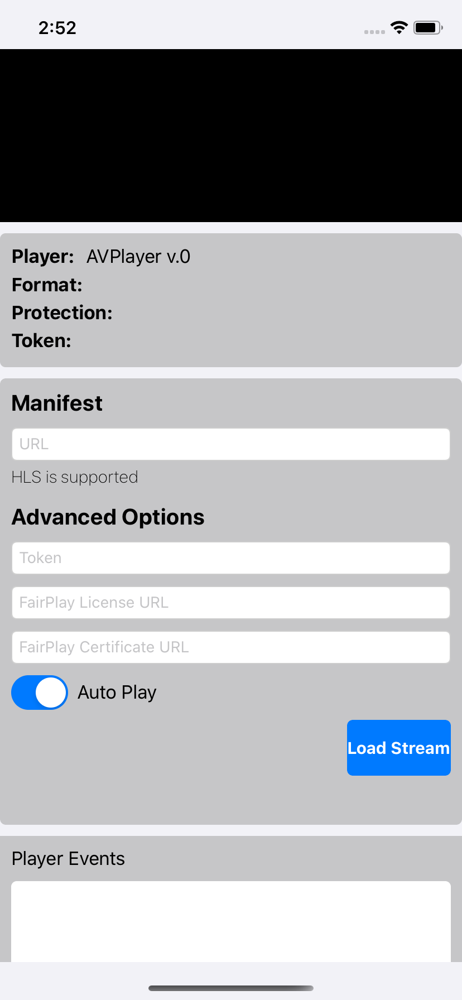

# Media Services 3rd Party Player Samples - AVPlayer

- [Overview](#overview)
- [How to use](#how-to-use)
  - [Set up development environment](#set-up-development-environment)
  - [Using sample player](#using-sample-player)
  - [Sample details](#sample-details)

## Overview

AVPlayer is an object that provides the interface to control the player's transport behavior. AVPlayer is part of AVFoundation, a framework that combines four major technology areas that together encompass a wide range of tasks for capturing, processing, synthesizing, controlling, importing and exporting audiovisual media on Apple platforms.

Its official documentation can be found [here](https://developer.apple.com/documentation/avfoundation/avplayer "AVPlayer documentation").

## How to use

### Set up development environment

- Install Xcode 11 + from the App Store in your Apple device.

### Using sample player

1. Clone the repository.

2. For opening the project in Xcode you must simply double click the file AVPlayer.xcodeproj.

3. For starting the emulator click the Play button on the top of the app.

4. Copy the link to your manifest URL and paste it in the `Manifest URL` field and click `Load Stream`.

    Alternatively, you can run the set up scripts to generate content, and host a static website with an index that will list links that use deep linking to open the app from any browser.
    The scheme and host used to open the app is `azure-samples://avplayer`, and the links include in this URLs all the data required for the player to reproduce the content.
    Note these links will appear only when the index is opened from a mobile device.

**Your video is now loaded.**

### Sample details

This player sample contains different options that you can set using query strings or manually set them once it's loaded.

- Manifest: Endpoint URL to the Azure Media Service content which is different for each case depending on the protocol and encryption method used.
- Token: JWT authentication token needed when using an encryption method (DRM or AES-128).
- FairPlay License: URL for FairPlay license.
- FairPlay Certificate: URL to the FairPlay Certificate.
- Auto Play: checked as default, will play the video as soon as it's loaded.

