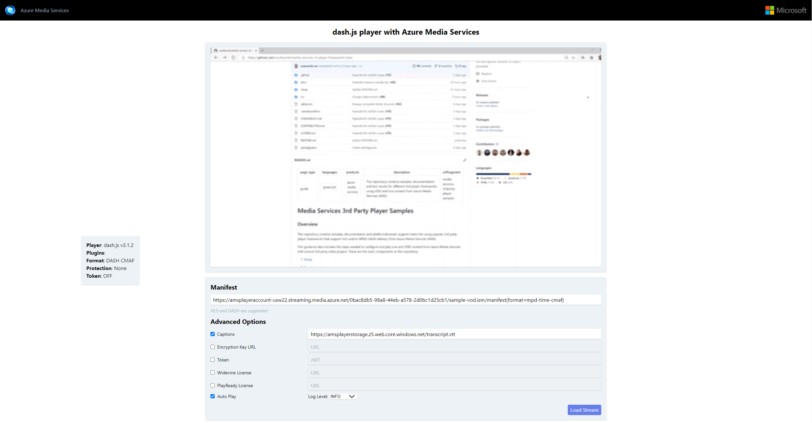

# Media Services 3rd Party Player Samples - dash.js

- [Overview](#overview)
- [How to use](#how-to-use)
  - [Setup development environment](#setup-development-environment)
  - [Using sample player](#using-sample-player)
  - [Sample details](#sample-details)

## Overview

dash.js is an initiative of the DASH Industry Forum to establish a production quality framework for building video and audio players that play back MPEG-DASH content using client-side JavaScript libraries leveraging the Media Source Extensions API set as defined by the W3C.

Documentation on how to implement your own player and test results with different formats and browsers [here](../../docs/dash.js).

## How to use

### Setup development environment

- Install [NodeJS v8+](https://nodejs.org/en/download/ "NodeJS v8+").

### Using sample player

1. Clone this repository.
2. Navigate through the console to the example's folder (src/) and run `npx http-server`. (*)
3. Open the browser of your choice and go to `http://localhost:8080/`.
4. Copy the link to your manifest URL and paste it in the `Manifest URL` field and click `Load Stream`. Your video is now loaded.

(*) Alternatively, you can run the [script](../../setup#upload-samplesps1) to host your player in a static website using your Azure account.

### Sample details

This player sample contains different options that you can set using query strings or manually set them once it's loaded.

- Manifest: Endpoint URL to the Azure Media Service content. This URL is different for each case depending on the protocol and encryption method used.
- Encryption Key URL: Endpoint URL to AMS's key delivery, used for token authorization exchange.
- Captions: URL for the video .vtt file needed to display captions.
- Token: JWT authentication token needed when using an encryption method (DRM or AES-128).
- Widevine License: URL for Widevine license required to play Widevine content.
- Auto Play: checked as default, will play the video as soon as it's loaded. The video will be muted due to browser requirement.
- Log Level: Choose the type of log you want to see in "Player Events" such as INFO, WARNING or ERROR.
  - WARNING: This level is used in the event of a problem that is undesirable, but it does not significantly impact the operation of the MASDK.
  - INFORMATION: This level is used for normal log messages.
  - DEBUG: This level is used for detailed log messages for debugging.

