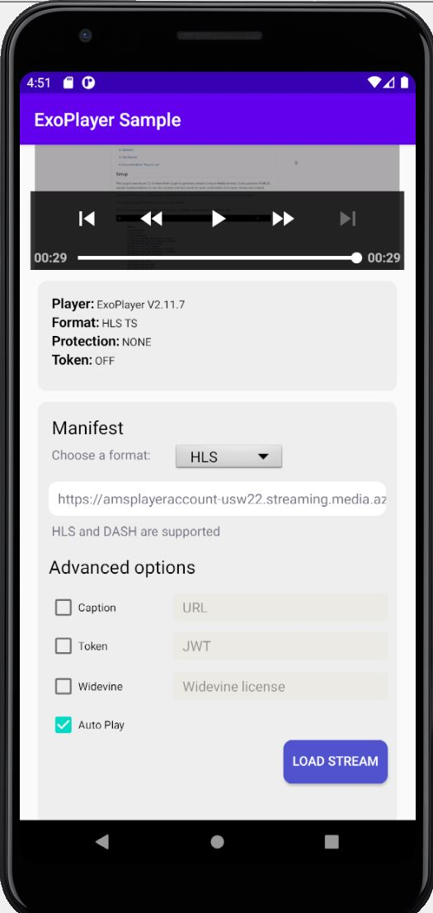

# Media Services 3rd Party Player Samples - ExoPlayer

- [Overview](#overview)
- [How to use](#how-to-use)
  - [Set up development environment](#set-up-development-environment)
  - [Using sample player](#using-sample-player)
  - [Sample details](#sample-details)

## Overview

ExoPlayer is an application level media player for Android. It provides an alternative to Android’s MediaPlayer API for playing audio and video both locally and over the Internet. ExoPlayer supports features not currently supported by Android’s MediaPlayer API, including DASH and SmoothStreaming adaptive playbacks.

Its official documentation can be found [here](https://exoplayer.dev/ "ExoPlayer documentation").

## How to use

### Set up development environment

- Install your Android development IDE. In this example, we'll use [Android Studio](https://developer.android.com/studio) 4.0.
- Install [Java 8+](https://www.java.com/ES/download/).

### Using sample player

1. Clone the repository.

   - (**If you're emulating an Android device**)

     ​ 1. In Android Studio, open the `src\exoplayer\app` folder. The app will load.

     ​ 2. Click on the "hammer" (1) to build the app. Select a device on the dropdown menu (2) and lastly run the emulation(3)

     

   - (**If you're using a physical Android device**)

     1. In Android Studio, open the `src\exoplayer\app` folder. The app will load.

     2. In the `Build` dropdown menu, click on `Build APK(s)`.

        

     3. Download and install the APK in your Android device

2. Copy the link to your manifest URL and paste it in the `Manifest URL` field and click `Load Stream`.

    Alternatively, you can run the set up scripts to generate content, and host a static website with an index that will list links that use deep linking to open the app from any browser.
    The scheme and host used to open the app is `azure-samples://exoplayer`, and the links include in this URLs all the data required for the player to reproduce the content.
    Note these links will appear only when the index is opened from a mobile device.

**Your video is now loaded.**

### Sample details

This player sample contains different options that you can set using query strings or manually set them once it's loaded.

- Manifest: Endpoint URL to the Azure Media Service content which is different for each case depending on the protocol and encryption method used.
- Captions: URL for the video .vtt file needed to display captions.
- Token: JWT authentication token needed when using an encryption method (DRM or AES-128).
- Widevine License: URL for Widevine license.
- Auto Play: checked as default, will play the video as soon as it's loaded. The video will be muted due to browser requirement.
- Log level: by default INFO is selected and will display all messages including errors, we can change it to show only the errors.

