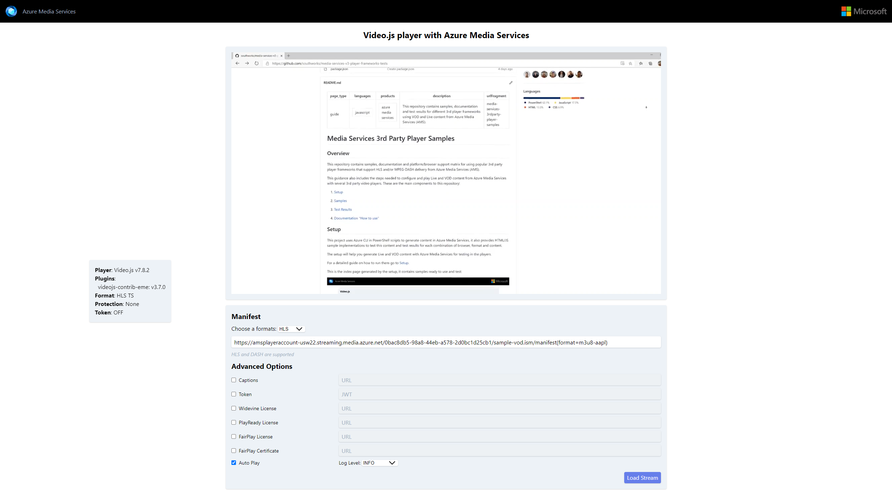

# Media Services 3rd Party Player Samples - Video.js

- [Overview](#overview)
- [How to use](#how-to-use)
  - [Set up development environment](#set-up-development-environment)
  - [Using sample player](#using-sample-player)
  - [Sample details](#sample-details)

## Overview

Video.js is a web video player built from the ground up for an HTML5 world. It plays adaptive media formats (such as DASH and HLS) in a browser, without using plugins or Flash. Instead, Video.js uses the open web standards MediaSource Extensions and Encrypted Media Extensions. Moreover, it supports video playback on desktops and mobile devices.

Documentation on how to implement your own player and test results with different formats and browsers [here](../../docs/video.js).

## How to use

### Set up development environment

- Install [NodeJS v8+](https://nodejs.org/en/download/ "NodeJS v8+").

### Using sample player

1. Clone this repository.
2. Navigate through the console to the example's folder (src/) and run `npx http-server`. (*)
3. Open the browser of your choice and go to `http://localhost:8080/`.
4. Copy the link to your manifest URL and paste it in the `Manifest URL` field and click `Load Stream`. Your video is now loaded.

(*) Alternatively, you can run the [script](../../setup#upload-samplesps1) to host your player in a static website using your Azure account.

### Sample details

This player sample contains different options that you can set using query strings or manually set them once it's loaded.

- Manifest: Endpoint URL to the Azure Media Service content. This URL is different for each case depending on the protocol and encryption method used.
- Captions: URL for the video .vtt file needed to display captions.
- Token: JWT authentication token needed when using an encryption method (DRM or AES-128).
- Widevine License: URL for Widevine license required to play Widevine content.
- PlayReady License: URL for PlayReady license required to play PlayReady content.
- FairPlay License: URL for FairPlay license required to play FairPlay content.
- FairPlay Certificate: URL to the FairPlay Certificate to use for playing FairPlay content.
- Auto Play: checked as default, will play the video as soon as it's loaded. The video will be muted due to browser requirement.
- Log Level: Choose the type of log you want to see in "Player Events" such as INFORMATION, ERROR, DEBUG or WARNING.
  - INFORMATION (default): only show log, log.warn, and log.error messages.
  - ERROR: only show log.error messages.
  - WARNING: only show log.warn and log.error messages.
  - DEBUG: show log, log.debug, log.warn, and log.error messages.

